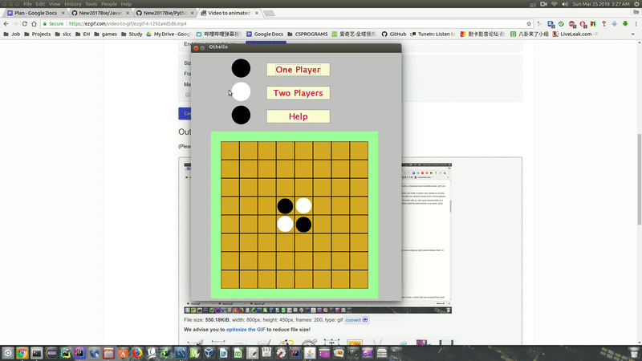

# JavaGames
It's a ongoing Othello board game project written in Java.
This is the Welcome Screen

  

So far only the "Two Players" is available, but I'll implement the AI to 
"One Player" in future.

Hit the "Two Players" to play the game.
If one side is out of move, it will change to the other side. 

  
  

